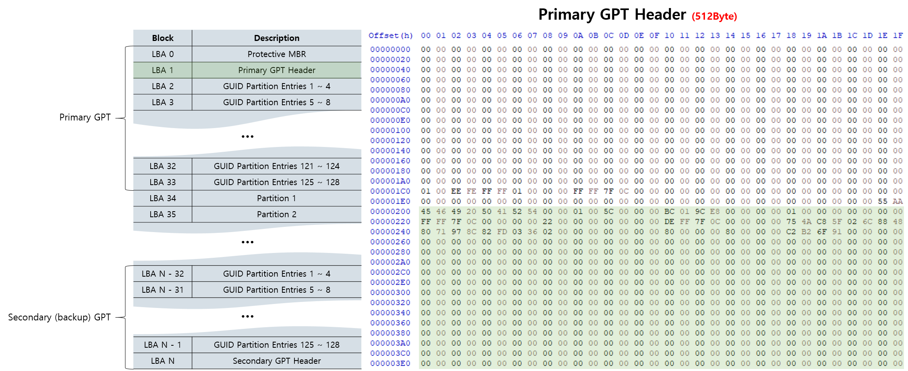

# GPT Parser


**Files:**
- `./binary/arm-gpt-parser` **:** `gpt-parser` for Linux ARM Architecture (Android Supported)
- `./binary/x86_64-gpt-parser` **:** `gpt-parser` for Linux x86_64 Architecture
- `./sample/motorola_moto_g5_plus_gpt.img` **:** GPT extracted from Motorola Moto G5 Plus
- `./sample/pc_gpt.img` **:** GPT extracted from my linux computer
- `./src/gpt-parser.c` **:** GPT Parser Source Code

**Usage:**
- Linux
```sh
sudo ./binary/x86_64-gpt-parser /dev/sda
```

- Export GPT in Linux
```sh
sudo dd if=/dev/sda of=gpt.img bs=512 count=34
./binary/x86_64-gpt-parser gpt.img
```

- Android
```sh
adb root
adb push ./binary/arm-gpt-parser /data/local/tmp/
adb shell "chmod 755 /data/local/tmp/arm-gpt-parser"
adb shell "/data/local/tmp/arm-gpt-parser /dev/block/mmcblk0"
```

- Export GPT in Android
```sh
adb root
adb shell "dd if=/dev/block/mmcblk0 of=/data/local/tmp/gpt.img bs=512 count=34"
adb pull /data/local/tmp/gpt.img
./binary/x86_64-gpt-parser gpt.img
```

## GPT(GUID Partition Table) Structure

GPT(GUID Partition Table)은 저장 장치에 대한 파티션 레이아웃 중 하나입니다.  
GUID Partition Table의 구조는 아래와 같습니다.


실제로 우리가 사용하는 컴퓨터의 GUID Partition Table도 확인해봅시다.  
`sudo dd if=/dev/sda of=gpt.img bs=512 count=34` 명령어로 Protective MBR(LBA 0)부터 GUID Partition Entries 125~128(LBA 33)까지 `gpt.img`에 저장을 할 수 있습니다.

아래는 'Protective MBR', 'Primary GPT Header', 'GUID Partition Entries'의 구조를 표현한 그림입니다.





